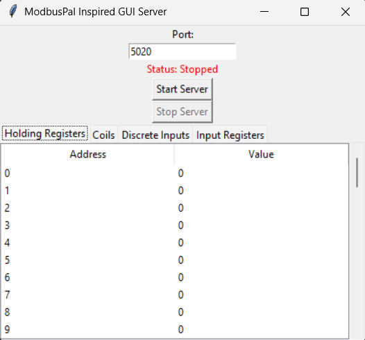

# Modbus Server (Educational Modbus TCP GUI Server)

This project provides a GUI-based Modbus TCP server written in Python. It is designed for **educational and research purposes** to understand Modbus server functionality and protocol interactions. The tool allows users to visually manage and monitor Modbus registers, coils, and discrete inputs through an intuitive graphical interface.

---

## ✨ Features

- Start/Stop Modbus TCP Server easily via GUI controls.
- Real-time visualization and editing of Modbus data blocks:
  - **Holding Registers (HR)**
  - **Input Registers (IR)**
  - **Coils (CO)**
  - **Discrete Inputs (DI)**
- Double-click editing capability for immediate data changes.
- Automatic data synchronization every second between the GUI and Modbus context.
- Cross-platform compatibility (Windows, Linux, macOS).

---

## 📷 Screenshots

## Screenshots1
*Main application window Server Stop.*  


## Screenshots2
*Main application window Server Started.* 


## 🛠️ Installation

### Requirements

- Python 3.7+
- `tkinter`  
  - **Windows/macOS**: Usually included  
  - **Linux**: Install with:
    ```sh
    sudo apt-get install python3-tk
    ```

### Clone the Repository

```sh
git clone https://github.com/YourUser/modbus-gui-server.git
cd modbus-gui-server
```


## 🔗 Dependencies  
This project uses the following Python modules:

- `pymodbus`  
- `tkinter`  
- Standard libraries: `asyncio`, `threading`, `sys`

### ✅ Quick Install

```sh
pip install -r requirements.txt
```

### 🛠️ Manual Install

```sh
pip install pymodbus
```

If you're on Linux and encounter `tkinter` issues:

```sh
sudo apt-get install python3-tk
```

---

## 🔌 Port Permissions

By default, Modbus TCP servers typically use port `502`, which may require administrator/root privileges on Unix/Linux systems.

For ease of testing, the default port for this GUI is set to **5020**. Adjust as needed based on your setup.

---

## 🚀 Usage

Run the Modbus server GUI:

```sh
python server_GUI.py
```

- Adjust the port if needed, then click **Start Server**.
- View and edit values directly through the GUI interface.
- Observe updates to data blocks reflected in real-time.

---

## 🔁 Data Interaction

- **Holding Registers and Input Registers**: Double-click an entry to modify numeric values.
- **Coils and Discrete Inputs**: Double-click an entry to toggle boolean values.

---

## 📦 Creating an Executable

You can convert this Modbus Server into a standalone executable for users without Python installed.

### 🔧 For Windows

```sh
pip install pyinstaller
pyinstaller --onefile --windowed server_GUI.py
```

The executable will be available in:

```
dist/server_GUI.exe
```

### 🐧 For Linux

```sh
pip install pyinstaller
pyinstaller --onefile server_GUI.py
chmod +x dist/server_GUI
```

---

## 🔽 Download Executable

- 🪟 [Download for Windows (.exe)](https://github.com/Rajeshawal/Modbus-server/releases/download/v.0.0.1/Modbus-server.exe)
- 🐧 [Download for Linux](https://github.com/Rajeshawal/modbus-server/releases/download/v1.0.0/ModbusTCP-server)

> ✅ No Python installation required. Just download, run, and connect to your Modbus server.

---


## ⚠️ Responsible Use and Disclaimer

- This tool is intended strictly for **educational and research purposes**.
- Only deploy this server in **controlled environments**.
- Unauthorized or irresponsible use may result in **physical risks**, **system instability**, or **legal consequences**.
- Use ethically and responsibly.

---

## 📄 License

This project is licensed under the **MIT License**.

---

## 🤝 Contributing

Pull requests and bug reports are welcome.  
Feel free to open an issue or submit a PR!

---

## 📁 Folder Structure

```txt
modbus-gui-server/
├── server_GUI.py       # Main server GUI script
├── images/             # GUI screenshots
├── requirements.txt    # Python dependencies
├── README.md           # Project documentation
└── LICENSE             # MIT License
```

---

## 🙏 Acknowledgements

- [Modbus.org](https://www.modbus.org) — Official protocol documentation  
- [PyModbus](https://github.com/riptideio/pymodbus) — Python Modbus implementation  
- Open-source contributors and educational communities
